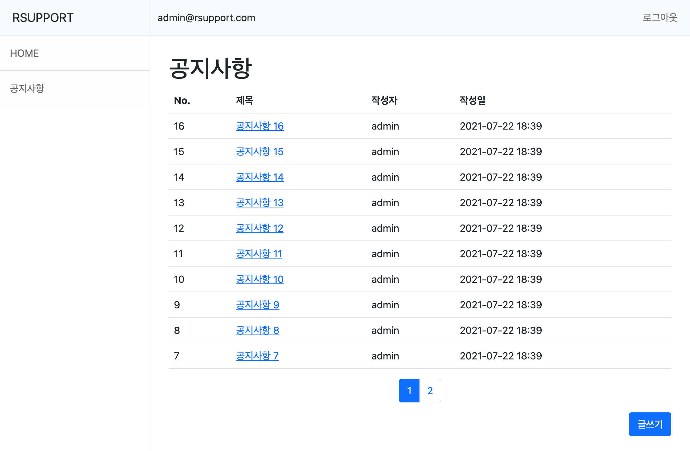

# 공지사항 게시판 구현
- 공지사항 CRUD
- 회원가입 
- 로그인

# Backend
- Java 1.8
- Spring Boot
- JPA
- H2
- Spring Security
- JUnit5
  
# Frontend
- thymeleaf
- javascript
- css, bootstrap

---
# 테이블 설계
- POST 게시글 테이블
- MEMBER 회원 테이블
- POST(N) : MEMBER(1)

# PAGE & API 
|기능|Method|URL|Return Page|
|------|---|---|---|
|공지사항 전체 조회|GET|/posts|전체 공지사항 조회|
|공지사항 등록 페이지|GET|/posts/create-form|공지사항 등록 페이지로 이동|
|공지사항 수정 페이지|GET|/posts/modify-form|공지사항 수정 페이지로 이동|
|공지사항 상세 조회|GET|/posts/{id}|공지사항 조회 페이지로 이동 및 조회|
|공지사항 등록|POST|/posts|공지사항 등록 및 목록으로 이동|
|공지사항 수정|PUT|/posts/{id}|공지사항 수정 및 목록으로 이동|
|공지사항 삭제|DELETE|/posts/{id}|공지사항 삭제 및 목록으로 이동|

# 실행 화면

